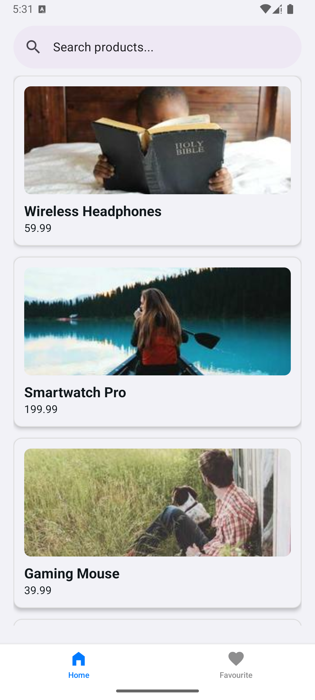
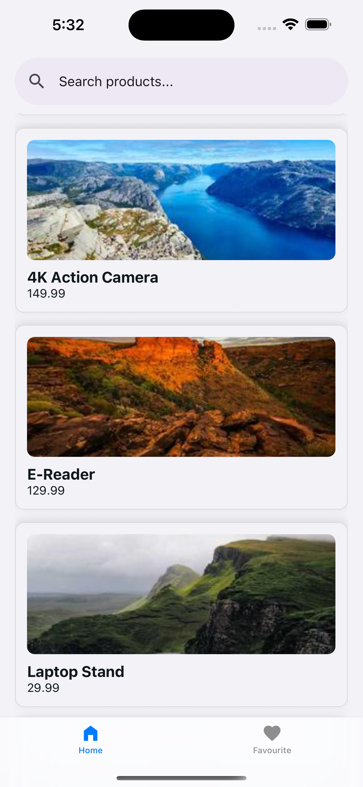
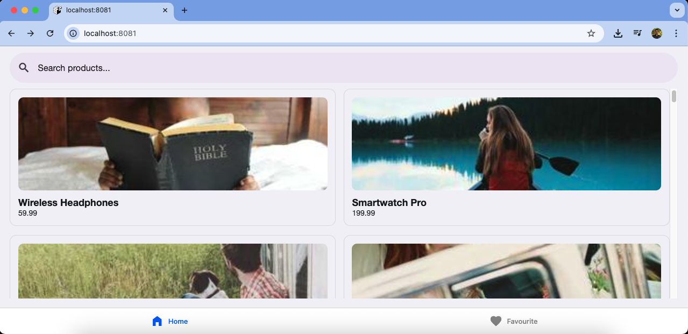
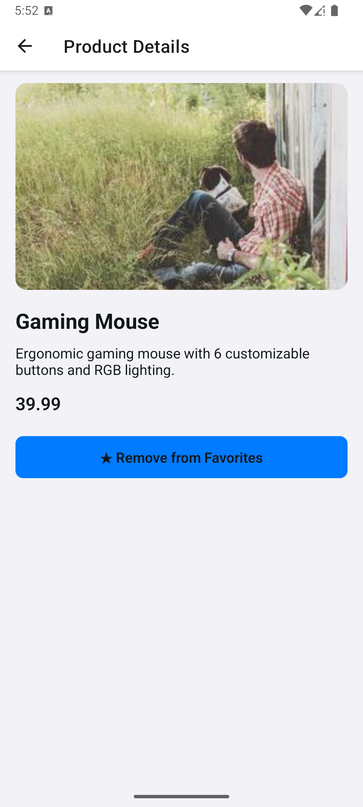
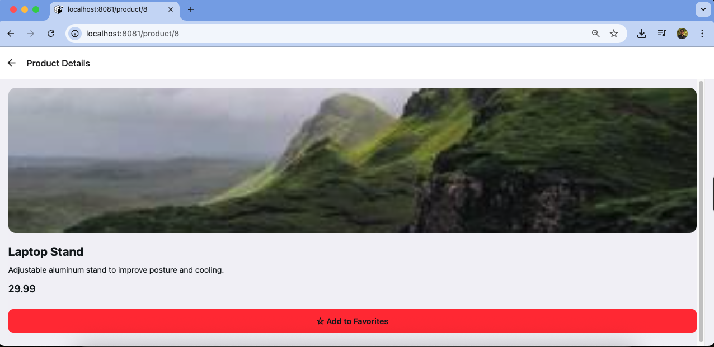
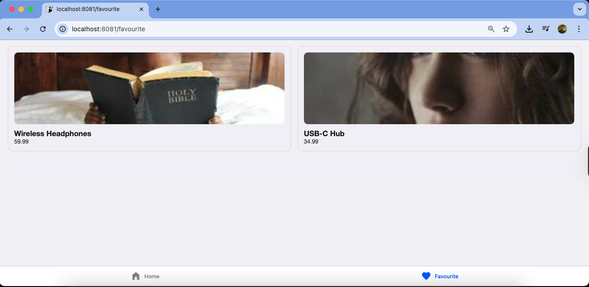

## 1. Project Setup Instructions

```bash
Prerequisites
Node.js : v22.15.1
Yarn : 3.6.4
Expo Version: 0.24.21
Expo Go app installed on your Android/iOS device (for testing on a real device)
```

1. Install dependencies using Yarn:

   ```bash
   yarn install
   ```

2. Start the development server:

   ```bash
   yarn expo start
   ```

3. From the terminal:

   ```bash
   Press a → Runs the app on an Android emulator (if installed) or opens QR code in Expo Go.
   Press i → Runs the app on an iOS simulator (Mac + Xcode required).
   Press w → Runs the app in your web browser.
   ```

4. To test on a physical device (via Expo Go):

   ```bash
   Make sure your device and PC are on the same Wi-Fi network.
   Open the Expo Go app and scan the QR code from the terminal or browser DevTools.
   ```

## 2. Project Overview

- Description: E-Commerce App

This e-commerce mobile application provides a simple and intuitive shopping experience. It includes a Home screen to browse products, a Product Details screen to view detailed information, and a Favourites list to save preferred items. The app features tab-based navigation for easy switching between sections and supports deep linking to open specific product pages directly from external links on both native and web platforms.

- Technologies used
  - React Native (Expo) – Cross-platform mobile app development framework.
  - Expo Router – File-based routing with tab-based navigation support.
  - React Navigation – For managing screen transitions and navigation flow.
  - Axios – For handling API calls and integrating backend data.
  - Redux Toolkit – For state management (e.g., favourites, product data).
  - Deep Linking Configuration – To open specific product pages from external links (native & web).
  - JavaScript/TypeScript – For scalable, type-safe development.
  - Theme Handling (Light/Dark Mode) – Dynamically adapts the app theme based on the device’s system appearance.
  - React Native Paper / UI Libraries (if applicable) – For prebuilt UI components and styling consistency.

- Key Features implemented
  - Home Screen:
    - Displays a curated list of products with essential information such as product image, name, and price.
    - Supports responsive design for a consistent experience across Android, iOS, and web.
    - Provides easy navigation to product details.
    - Includes **search functionality** to quickly filter and find products by name.
  - Product Details Screen:
    - Shows detailed product information including images, description, and price.
    - Designed for clarity and easy user interaction.
    - Includes options for adding items to favourites.
  - Persistent State Handling**
    - Implemented using **Redux Persist** to store and rehydrate Redux state (e.g., favourites) across app restarts.
    - Ensures user preferences and saved items remain available even after closing the app.
  - Favourites List Screen:
    - Allows users to view and manage their favourite products.
    - Provides quick access to saved items.
    - Updates dynamically when users add or remove items.
  - Tab-Based Navigation:
    - Implemented a tab view for seamless navigation between key sections like Home and Favourites.
    - Ensures smooth user flow and quick access to major features.
  - Deep Linking Support:
    - Enables users to open a specific product page directly from external links, enhancing shareability and user experience.
    - Configured deep links for both native and web platforms.
    - Example:
      - Native: myshoplite://product/{id}
      - Web: /product/{id}

## 3. Technical Decisions & Architecture

- State management approach and rationale
  - The app uses Redux Toolkit for state management to maintain a centralized and predictable data flow. This approach simplifies handling global states like favourites and product data, ensures consistency across screens, and provides better scalability for future features such as authentication and cart management.

- Component architecture decisions
  - The app follows a modular and reusable component architecture, separating UI, logic, and styles for better maintainability.
  - UI Components: Focused on presentational elements (e.g., product list, Empty view).
  - Custom Hooks: Encapsulate business logic and API interactions (e.g., fetching products, handling favourites).
  - Theming & Styles: Centralized for consistent design and easy dark/light mode support.
  - Screen Components: Organize high-level layout and navigation logic.
    This approach improves code reusability, scalability, and makes future enhancements easier.

- Data persistence strategy
  - The app uses Redux Persist to automatically store and rehydrate the Redux state (e.g., favourites, user preferences) in local storage. This ensures that user data remains available even after the app is closed or restarted, providing a seamless user experience.

- Performance considerations
  - Efficient State Management: Used Redux Toolkit with selective slices and memoized selectors to avoid unnecessary re-renders.
  - Redux Persist Optimization: Persist only required data (e.g., favourites) to reduce storage overhead.
  - Code Splitting: Load screens and assets on demand to improve startup time.
  - FlatList : Leveraged FlatList for product lists to efficiently render large datasets.
  - Theme: Memoized theme values to avoid redundant UI updates.

- Security considerations
  - Secure API Communication: Ensured all API calls use HTTPS to protect data in transit.

## 4. Screenshots/GIFs

1. List Screen - showing products and search

- Home Screen Product List

| Android                                                             | iOS                                                         | Web                                                         |
| ------------------------------------------------------------------- | ----------------------------------------------------------- | ----------------------------------------------------------- |
|  |  |  |

- Search Product
- 

2. Details Screen - Showing product details and favorite toggle

| Android                                                                       | iOS                                                                   | Web                                                                   |
| ----------------------------------------------------------------------------- | --------------------------------------------------------------------- | --------------------------------------------------------------------- |
|  |  |  |

3. Favorites Screen - showing favorited products
   | Favourite List | Empty Case | Favourite List |
   |---------|-----|-----|
   |  |  |  |

4. Responsive Design - web layout (2 columns) vs mobile (1 column)

- [Watch Responsive Video](https://drive.google.com/file/d/15qwkNz3Mia_v1T50doqgLXulbjUSR_nk/view?usp=sharing)

5. Deep Link Demo

- [Deep Link Demo](https://drive.google.com/file/d/1raTFJfCrhr6hXVE1ARD5MhdiTBLtKCgQ/view?usp=sharing)

## Favorites Persistence Demo (Data Saved Across Restarts)

- [Persistence Demo](https://drive.google.com/file/d/1OdxOmdneW7B9NyB2D0XtWQ51h5KnAv1i/view?usp=sharing)

## To Test Deep Link

Follow the steps below to test deep links across Android, iOS, and Web:

1. Install and Run Development Build:\*\*

```bash
  npx expo run:android
  npx expo run:ios
```

2. **Test on Android (Emulator):**

```bash
  npx uri-scheme open "myshoplite://product/3" --android
```

3. **Test on iOS (Simulator):**

```bash
   npx uri-scheme open "myshoplite://product/3" --ios
```

4. **Test on Web (Browser):**

```
http://localhost:8081/product/3
```
> These commands allow you to directly open specific product pages using deep linking in your development environment.

